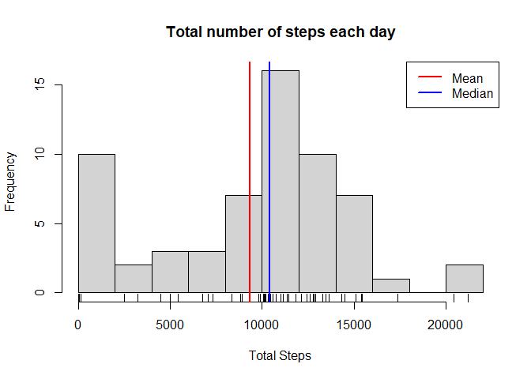
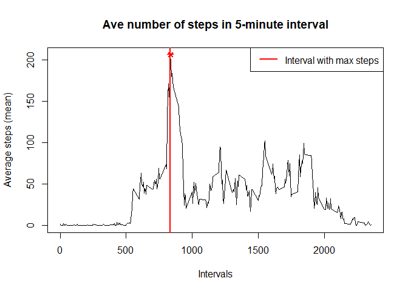
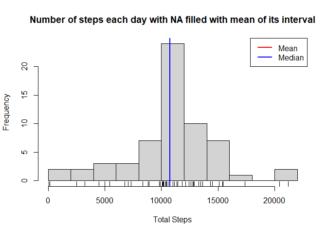
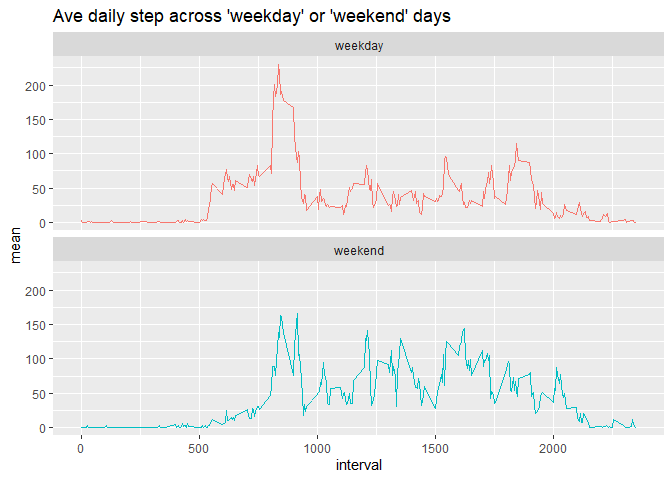

## Rmd file for Reproducible Research Project 1

This is an R Markdown document for submission to the Reproducible Research Course - Project Assignment 1. 

This document is presented in multiple parts that contains the prompted questions in the assignment and with it is the r code chunk that answers those questions. 
The data used in this document is from file "activity.csv" which is contained in "activity.zip". They were downloaded and collected as part of the data about personal movement using activity monitoring devices, see README.md for details and references to the experiment.

### Loading and preprocessing the data
We use the dplyr package for data manipulation and base plotting and ggplot2 packages.

The data is in csv format so we use the read.csv() function in conjunction with unz() function to read from "activity.zip" file. Data is loaded into raw_df dataset. To have more insight on the structure and classes of data, we use str(). We observed that date variable is in char so we apply data conversion on date into a as.Date() class.


```r
library(dplyr)
```

```
## 
## Attaching package: 'dplyr'
```

```
## The following objects are masked from 'package:stats':
## 
##     filter, lag
```

```
## The following objects are masked from 'package:base':
## 
##     intersect, setdiff, setequal, union
```

```r
raw_df <- read.csv(unz("activity.zip", "activity.csv"))
str(raw_df)
```

```
## 'data.frame':	17568 obs. of  3 variables:
##  $ steps   : int  NA NA NA NA NA NA NA NA NA NA ...
##  $ date    : chr  "2012-10-01" "2012-10-01" "2012-10-01" "2012-10-01" ...
##  $ interval: int  0 5 10 15 20 25 30 35 40 45 ...
```

```r
raw_df$date <- as.Date(raw_df$date)
```

### What is mean total number of steps taken per day?
For this part of the assignment, you can ignore the missing values in the dataset.

1. Make a histogram of the total number of steps taken each day

2. Calculate and report the **mean** and **median** total number of steps taken per day

```r
day_df <- raw_df %>% 
          group_by(date) %>% 
          summarise( total = sum(steps, na.rm = TRUE) )
```

```
## `summarise()` ungrouping output (override with `.groups` argument)
```

```r
total <- day_df$total
ave <- mean(total)
med <- median(total)
```

Total steps on each day is save in variable total. Then we calculate the mean and median of the total; 

* **mean = 9354** 

* **median = 10395 **

We then plot the histogram of the total and placed vertical line corresponds to **mean** and **median**.

```r
hist(total, breaks = 10, 
         main = "Total number of steps each day",
         xlab = "Total Steps")
rug(total)
abline(v = c(ave,med), col=c("red","blue"), lwd=2)
legend("topright",legend=c("Mean","Median"), col=c("red","blue"), lty=1, lwd=2:2)
```

<!-- -->

```r
summary(total)
```

```
##    Min. 1st Qu.  Median    Mean 3rd Qu.    Max. 
##       0    6778   10395    9354   12811   21194
```

### What is the average daily activity pattern?
1. Make a time series plot (i.e. `type = "l"`) of the 5-minute interval (x-axis) and the average number of steps taken, averaged across allays (y-axis)

2. Which 5-minute interval, on average across all the days in the dataset, contains the maximum number of steps?

```r
series_df <- raw_df %>% 
      group_by(interval) %>% 
      summarise(mean = mean(steps, na.rm = TRUE))
```

```
## `summarise()` ungrouping output (override with `.groups` argument)
```

```r
with(series_df, 
     plot(interval,mean, type="l",
          main = "Ave number of steps in 5-minute interval", 
          xlab = "Intervals", 
          ylab = "Average steps (mean)")
     )
max_mean = max(series_df$mean)
max_interval = filter(series_df,mean==max_mean)[1]

abline(v = max_interval, col="red", lwd=2)
points(max_interval, max_mean, pch=8, lwd=2, col="red")
legend("topright",legend = "Interval with max steps", col=c("red"), lty=1, lwd=2)
```

<!-- -->

The 5-minute **interval id = 835 ** contains the maximum mean number of steps which is **mean = 206 ** steps.

### Imputing missing values

Note that there are a number of days/intervals where there are missing
values (coded as `NA`). The presence of missing days may introduce
bias into some calculations or summaries of the data.

1. Calculate and report the total number of missing values in the dataset (i.e. the total number of rows with `NA`s)

2. Devise a strategy for filling in all of the missing values in the dataset. The strategy does not need to be sophisticated. For example, you could use the mean/median for that day, or the mean for that 5-minute interval, etc.

3. Create a new dataset that is equal to the original dataset but with the missing data filled in.

4. Make a histogram of the total number of steps taken each day and Calculate and report the **mean** and **median** total number of steps taken per day. Do these values differ from the estimates from the first part of the assignment? What is the impact of imputing missing data on the estimates of the total daily number of steps?

We calculate the total number of NA's from raw_df which is 

```r
tot <- sum(is.na(raw_df$steps))
tot
```

```
## [1] 2304
```
and it represents an 

```r
ave <- mean(is.na(raw_df$steps))
ave
```

```
## [1] 0.1311475
```
or an equivalent to **13%**.

The missing values (NA) are replaced with the mean of its **interval** computed from previous item. We mutate() the variable **steps** such that if the original value is NA it is replaced with the mean else the value is kept. After filling up the values, we compute the mean, median and total steps by date, then plot the histogram of the total steps with filled up values.  

```r
filled_df <- inner_join(raw_df,series_df, by="interval") %>% 
      mutate(steps = ifelse(is.na(steps), mean, steps))

perday <- filled_df %>% 
    group_by(date) %>% 
    summarise( total = sum(steps) )
```

```
## `summarise()` ungrouping output (override with `.groups` argument)
```

```r
total_step <- perday$total
ave_fill <- mean(total_step)
med_fill <- median(total_step)

hist(total_step, breaks = 10, 
     main = "Number of steps each day with NA filled with mean of its interval",
     xlab = "Total Steps")
rug(total_step)
abline(v = c(ave_fill,med_fill), col=c("red","blue"), lwd=2)
legend("topright",legend=c("Mean","Median"), col=c("red","blue"), lty=1, lwd=2:2)
```

<!-- -->

```r
summary(total_step)
```

```
##    Min. 1st Qu.  Median    Mean 3rd Qu.    Max. 
##      41    9819   10766   10766   12811   21194
```

It can be observed that after filling up the missing values with mean of its interval, the values of **mean** and **median** are the same. This is in contrast to the first histogram of total steps which has different values for it mean and median. 

### Are there differences in activity patterns between weekdays and weekends?
For this part the `weekdays()` function may be of some help here. Use
the dataset with the filled-in missing values for this part.

1. Create a new factor variable in the dataset with two levels -- "weekday" and "weekend" indicating whether a given date is a weekday or weekend day.

2. Make a panel plot containing a time series plot (i.e. `type = "l"`) of the 5-minute interval (x-axis) and the average number of steps taken, averaged across all weekday days or weekend days (y-axis). 


```r
library(ggplot2)
dow_df <- filled_df %>% mutate(days=weekdays(date),dow = ifelse(weekdays(date) %in% c("Saturday","Sunday"),"weekend","weekday"))

dowinterval <- dow_df  %>% 
      group_by(dow,interval) %>% 
      summarise(mean = mean(steps))
```

```
## `summarise()` regrouping output by 'dow' (override with `.groups` argument)
```

```r
dowinterval %>% 
      ggplot(aes(interval,mean,color=dow)) + 
      labs(title = "Ave daily step across 'weekday' or 'weekend' days") +  
      geom_line() + 
      facet_wrap( ~ dow, ncol=1) + 
      guides(color=FALSE)
```

<!-- -->

In this part, we use the ggplot2 plotting system for panel plotting. 

First, we manipulate (mutate) the filled_df dataset to add new variable "dow" (day-of-week) to contain two values 'weekday' and 'weekend'. We use weekdays() function to check the literal weekday of the variable date, then use the ifelse() function that if the weekdays(date) is either "Saturday" or "Sunday", the value 'weekend' is assigned to variable dow otherwise we assign 'weekday'. The result of this manipulation is saved at dow_df dataset.

Second, from the dow_df, we compute the mean steps of the intervals across dow and store the result to dowinterval which is the source dataset of the time series plot.

Then, using ggplot2 we make a facet plot containing a time series plots of the 5-minute interval (x-axis) and the average number of steps taken, averaged across all weekday days or weekend days (y-axis). 


